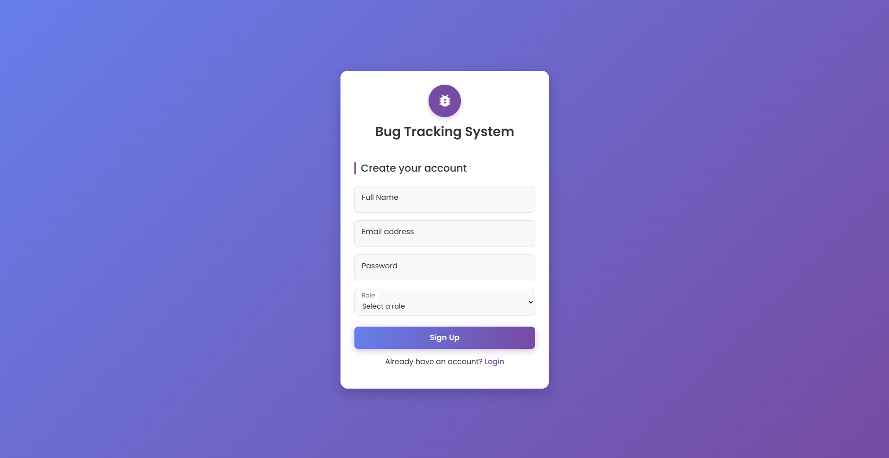
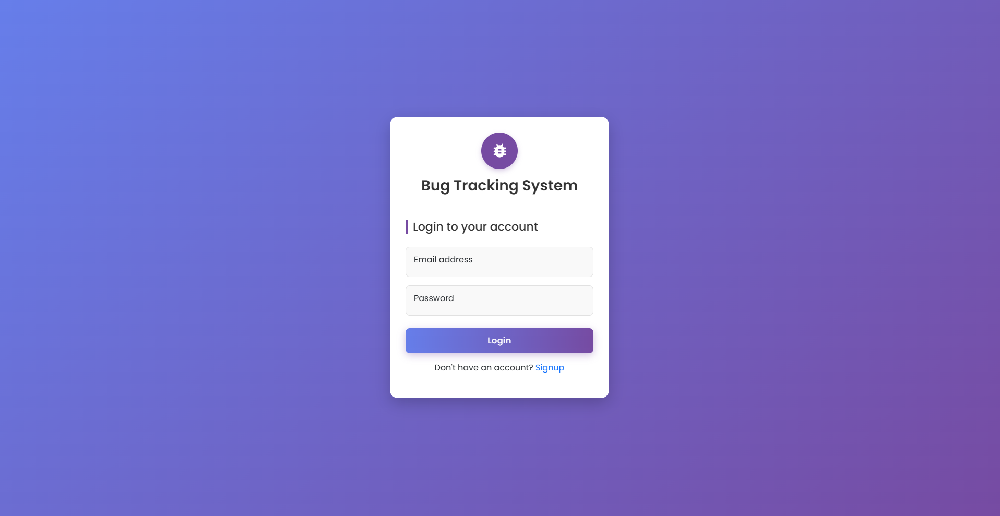
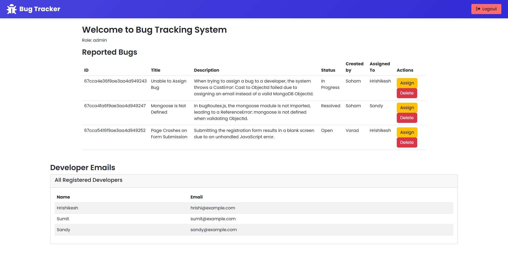
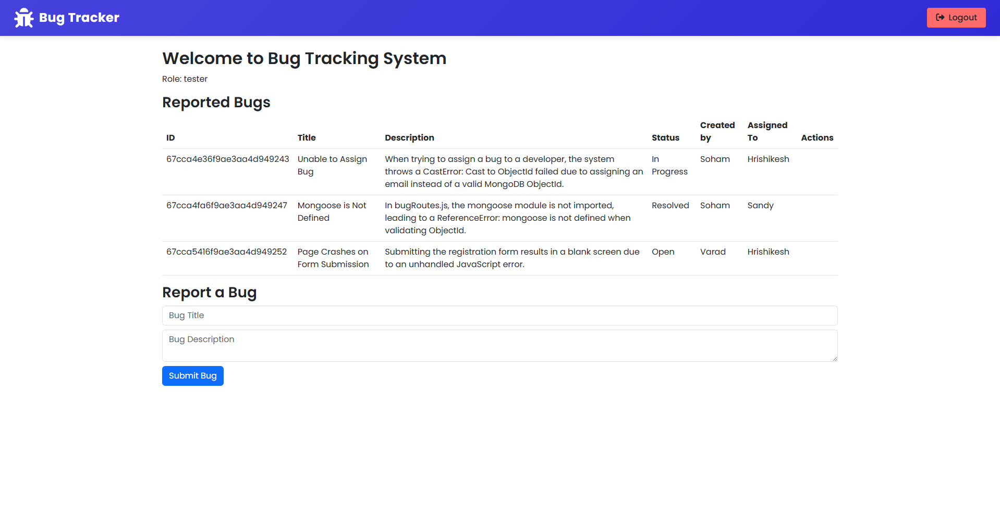
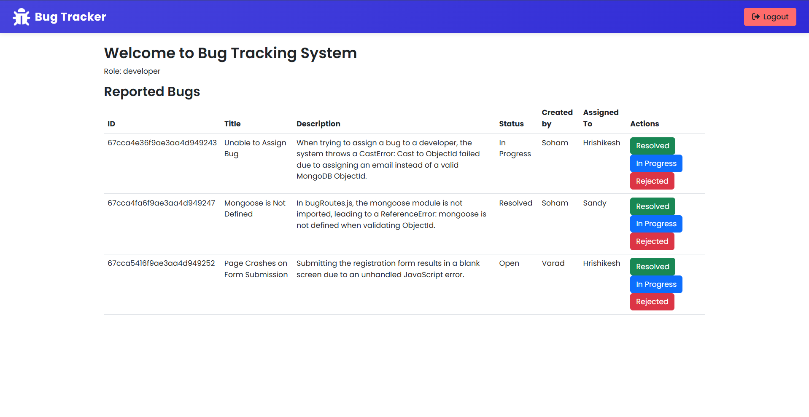

# 🐞 Bug Tracking System

A full-stack bug tracking web application where **testers report bugs**, **developers fix them**, and **admins manage the entire process** built for real-world team collaboration and role-based access control.

## 🚀 Tech Stack

- **Backend:** Node.js, Express.js  
- **Database:** MongoDB (Mongoose ORM)  
- **Authentication:** JWT (JSON Web Tokens)  
- **Security:** Bcrypt (Password Hashing)  
- **Frontend:** HTML, CSS, Bootstrap (Responsive UI)

## 🔐 Features

- 🧑‍💻 **Role-based Access**  
  - **Admin**: Assign bugs, manage users  
  - **Tester**: Report bugs  
  - **Developer**: Fix and resolve bugs

- 🐛 **Bug Lifecycle Management**
  - Create → Assign → Fix → Verify → Close

- 🔒 **Secure Auth**
  - JWT-based authentication
  - Bcrypt password hashing

- 📊 **Dashboard Views**
  - Personalized views for each role
  - Bug status tracking (Open, In Progress, Fixed, Closed)

## 📸 Screenshots

### 👤 User Signup Page  

---

### 🔐 Login Page  

---

### 📋 Admin Dashboard  

---

### 🐞 Bug Submission Page  (Tester's Dashboard)

---

### 🐞 Developer's Dashboard

---

